# Offline Sync with Azure Mobile Client - August 2017

Modern Apps require an ability to quickly and efficiently authenticate users while providing Online/Offline Syncing. We will be building a small chat app

### Prerequisites

Make sure you have checked out the general [Meetup Prerequisites](https://github.com/SDXamarinDevs/Meetups)

## Level 0

- Setup Azure App Service (Mobile App)
- Setup Azure SQL Database/Server
- Configure the App Service to use the Azure SQL Database

### Create the Azure Resources

- Sign into the [Azure Portal](https://portal.azure.com)
- Click `New` (in the upper left hand corner), Create a `Mobile App`
  - App Name: `sdxamdevsteam{your team number}`
  - Choose the Subscription you want the resources on
  - You can create a resource group: MonkeyChat
  - If you already have an app service plan you can deploy it to your existing plan without additional cost. Otherwise you can create a new plan in the West Coast.

<details>
  <summary>Create Mobile App Service</summary>

  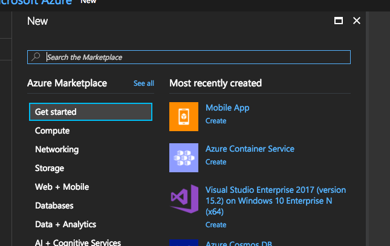

  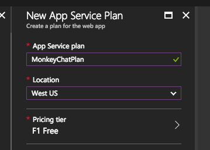

  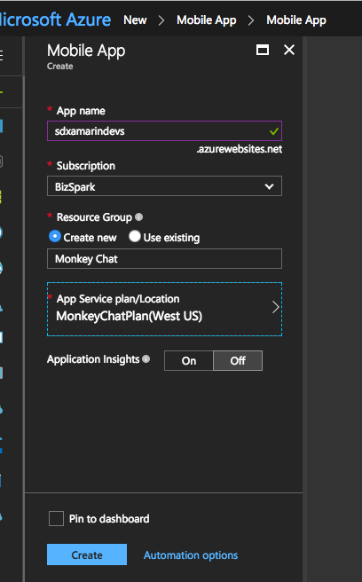

  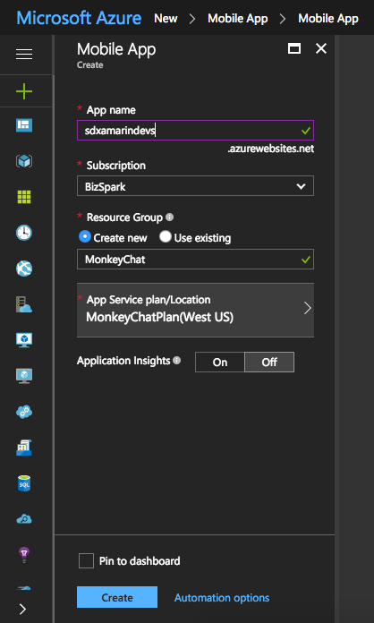

</details>
<p />

- Click `New`, Create a `SQL Database`
  - If this is your first database you will need to create a new server for it. Make note of the username and password you select

<details>
  <summary>Create SQL Database</summary>

  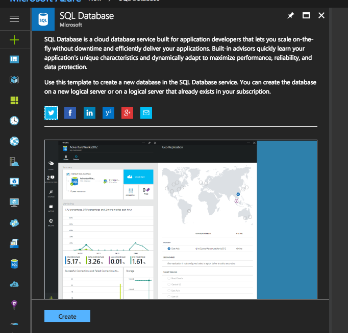

  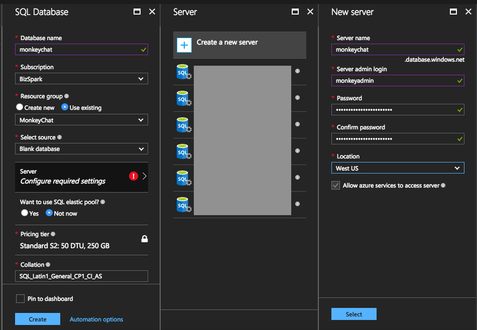

</details>
<p />

### Configure the App Service

<details>
  <summary>Configure App Service</summary>

  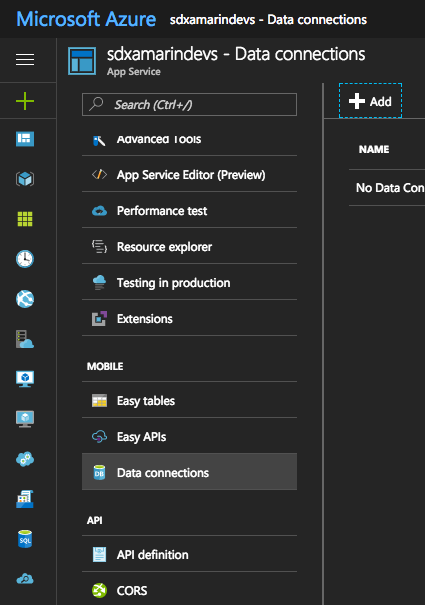

  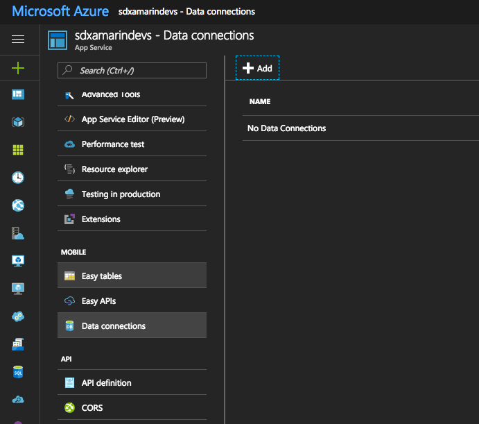

  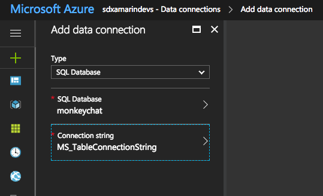

</details>
<p />

## Level 1

- Setup the App Service to have the tables you want. (see Boss Level)

### Setup Easy tables

Create one or more tables as your team decides. For example create a Table named TodoItem to validate your connection using the included view from the QuickStart Template.

<details>
  <summary>Setup Easy Tables</summary>

  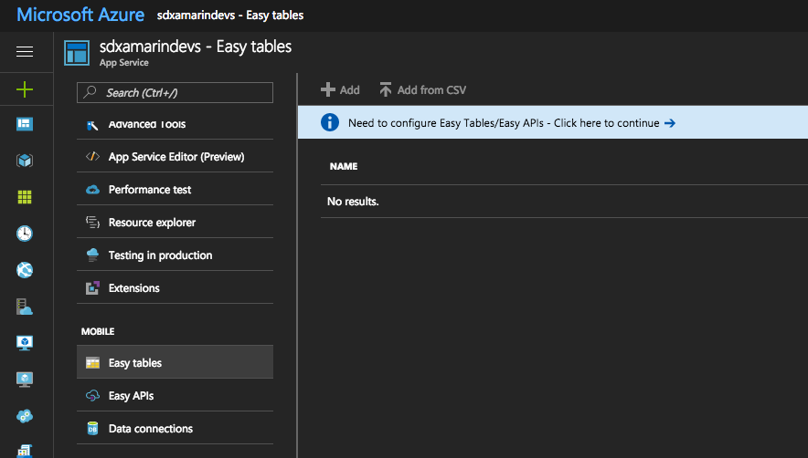

  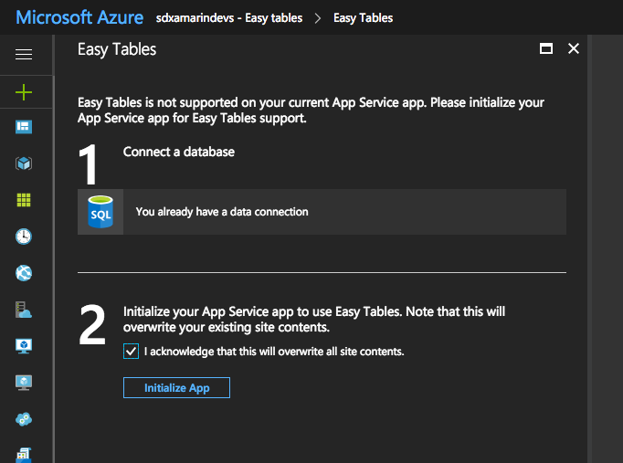

  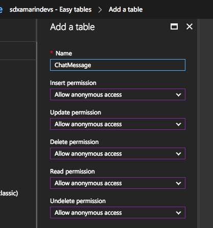

</details>
<p />

### Create the Mobile App Project

Using the QuickStart Templates, create a new Xamarin Forms application using Prism and DryIoc. To do this open your CLI and enter the command `dotnet new prismforms -h`. This will list the full help file with all of the options available for the QuickStart Template. Be sure to take note of the Data Providers as you will want to include the `AzureMobileClient`. If you forget to do this you will lose out on all of the bootstrapping for both the Microsoft.Azure.Mobile.Client and AzureMobileClient.Helpers libraries.

After opening your solution add

- FFImageLoading Plugin for Xamarin Forms
- FFImageLoading Transformations
- Xam.Plugins.Settings

Add the Starter files to your project, and update your platform project to initialize FFImageLoading. Note that the starter files in the Resources folder will need to be added to the Platform Project(s) not the shared .NET Standard library.

<details>
  <summary>Platform Configurations</summary>

**iOS AppDelegate**

```cs
[Register("AppDelegate")]
public partial class AppDelegate : FormsApplicationDelegate
{
    public override bool FinishedLaunching(UIApplication uiApplication, NSDictionary launchOptions)
    {
        global::Xamarin.Forms.Forms.Init();
        global::FFImageLoading.Forms.Touch.CachedImageRenderer.Init();
        global::FFImageLoading.ImageService.Instance.Initialize();

        // Code for starting up the Xamarin Test Cloud Agent
#if DEBUG
        Xamarin.Calabash.Start();
#endif
        LoadApplication(new App(new iOSInitializer()));

        return base.FinishedLaunching(uiApplication, launchOptions);
    }
}
```

**Android MainActivity**

```cs
[Activity(Label = "@string/ApplicationName",
          Icon = "@mipmap/ic_launcher",
          Theme = "@style/MyTheme",
          ConfigurationChanges = ConfigChanges.ScreenSize | ConfigChanges.Orientation)]
public class MainActivity : FormsAppCompatActivity
{
    protected override void OnCreate(Bundle savedInstanceState)
    {
        TabLayoutResource = Resource.Layout.Tabbar;
        ToolbarResource = Resource.Layout.Toolbar;

        base.OnCreate(savedInstanceState);

        global::Xamarin.Forms.Forms.Init(this, savedInstanceState);
        global::FFImageLoading.Forms.Droid.CachedImageRenderer.Init();
        global::FFImageLoading.ImageService.Instance.Initialize();

        LoadApplication(new App(new AndroidInitializer(Application)));
    }
}
```

</details>
<p />

## Level 2

- Prove you can sync data between the app and the cloud

**CHEAT CODE:** Use the TodoItem model in the Prism QuickStart Template (the UI and everything is already there)

## Level 3

- Update your App to show Chat Bubbles for messages sent between users. Messages should show the sender with all messages sent by the authenticated user on the left side and all other messages on the right side.
- Replace the default Prism icons with your own image.

### Considerations

Since we are not using Authentication you will need to determine who your user is. The starter file for Settings includes both `EmailAddress` and `DisplayName` properties. Consider using a simple registration page that asks the user for these fields.

<details>
  <summary>Assets</summary>

Find and download an [image](https://www.google.com/search?q=monkey+chat&source=lnms&tbm=isch&sa=X&ved=0ahUKEwiG2qr_svvVAhUX02MKHVjCAIkQ_AUIDCgD&biw=1440&bih=708) to use on the Splash Screen and as the App Icon.

You can get all of the icons generated for you using [Make App Icon](https://makeappicon.com/). Read the `GettingStarted.txt`, in the .NET Standard project.

</details>
<p />

## Boss Level

- Users should be able to view/create a new Channel
- Each Channel should have a list of it’s own messages

<details>
  <summary>Models</summary>

```cs
public class Channel : EntityData
{
  public string Name { get; set; }
}

public class ChatMessage : EntityData
{
  public string ChannelId { get; set; }
  public string Message { get; set; }
  public string FromEmail { get; set; }
}
```

</details>

### Bonus

Add a table that tracks the DisplayName and EmailAddress of each user. Change your ChatMessage to track that User's Id. Now Add one or more converters to help you convert the ID to the DisplayName & FromEmail

<details>
  <summary>Notes</summary>

Your converter will need to be able to lookup the User table. There are numerous ways to achieve this, but here are a couple to get you started....

**Code Behind**

```cs
public class FooConverter : IValueConverter
{
  IAppDataContext _context { get; }

  public FooConverter()
  {
    _context = (Application.Current as App).Container.Resolve<IAppDataContext>();
  }
}
```

**Resources**

```cs
public partial class App : PrismApplication
{
  protected override void OnInitialized()
  {
    Resources.Add("dataContext", Container.Resolve<IAppDataContext>());
  }
}
```

```xml
<Label Text="{Binding Model.UserId,Converter={StaticResource fooConverter},ConverterParameter={StaticResource dataContext}}" />
```

</detail>